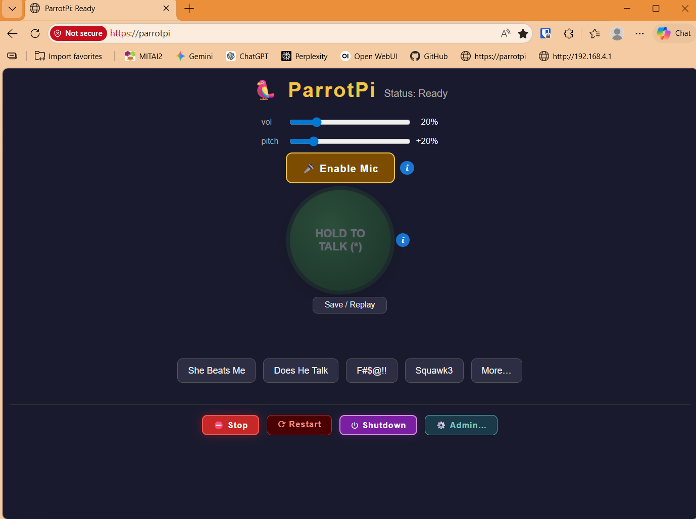

# ParrotPi — Raspberry Pi Animatronic Controller

This is a python3 flask web server for a raspberry pi-controlled anamatronic toy parrot.  It serves a web page which 
sends REST calls to the server such as move beak open/close, increase/
decrease volume, playback a phrase (previously recorded wav file), and
provide a push-to-talk socketio microphone near-realtime stream to
playback through the parrot.  It also has a few admin features that allow the user to save off his/her ad-hoc voice (when using push-to-talk capability) so that it can be replayed at a later tiome. When the parrot noises are played,
the beak servo opens and closes while playing.  It also has a start
up wav file that it plays upon start up to make sure that the sound card
(MAX-98357A) was initialized properly and is working ok.

## Features
- Every several seconds the web pages asks the server for a "busy" status which tells the web page if someone else is using the parrot.  The web page will disable its buttons if it is busy.
- There is a volume and pitch control on the web page that allows the user to change the volume and pitch of the parrot voice.
- There is an emergency STOP button on the web page that can be used if the state of the server and page gets out of whack.
- There is also a Restart button on the web page that allows a user to restart the server itself-- again for emergencies.
- There is a Request/Allow Mic Access button on the web page that requests access to the microphone (either on a PC or phone).  Once the user acknowledges/allows access, then the allow state is set to true and the Hold to Talk button enables.
- When the Hold to Talk button is pressed, it will stream the users voice over socketio to the server which will play back the voice in near-real time to the speaker of the pi.  It will also apply a pitch and volume based on those slider values on the web page.
- There are several pre-recorded WAV files that the user of the web page can use to play back phrases and the "Replay" button plays back the last recorded phrase when a user had clicked the Hold to Talk button.
- There are also a few beak open/close buttons that tell the server to open/close the parrot's beak
- There is also an Admin dialog that shows network information
- Again, remember, though, that the buttons are enabled when the parrot server has returned a not-busy poll.
- Boots automatically into a WiFi access point mode with SSID of ParrotPi (you can reconfigure the pi to just join a network as a DHCP client, too if you want)
- At boot, the parrotpi python program starts up as a service automatically.
- When the python program starts, it will automatically issue the SQUAWK!! parrot sound through the speaker to help you ensure that indeed the program has started and has access to the audio and servo.




## Usage
1. Turn on the Pi
2. On your phone or client, join the `parrotpi` WiFi network
3. Open a browser to `https:\\192.168.4.1`
4. Click the "SAY" buttons to make the parrot speak pre-recorded phrases
5. Click the "More..." buttons to make the parrot speak saved phrases that were saved off during the party
6. Enable the Mic and then push and hold the "Hold to Talk" button to make the parrot speak ad-hoc phrases
7. Use the "Save/Replay" button to save off the last ad-hoc phrase that you used or delete previous ad-hoc phrases
8. Use the "Shutdown" button to shutdown the pi.

## Hardware
- RaspberryPi B+
- MAX-98357A Audio Card
- External 4 Ohm Speaker
- Micro 9g servo
- PCA9685 GPIO buffer card (to protect GPIO/current spikes)
  

## Directory Structure
```
parrotpi/
  app/
    server.py
    gpio_inputs.py
    servo_controller.py
    sim_servo.py
    real_servo.py
    config.py
    static/
      audio/
       various WAV files
    templates/
       index.html
  install_as_service.sh
``` 

## Logging
When run as a service, writes to `/var/log/parrotpi/server.log` with logrotate support.

## Systemd Integration
A custom script (`install_as_service.sh`) installs the project as a systemd service so it:
• 	starts automatically at boot
• 	waits for Wi‑Fi/network
• 	restarts on crash
• 	logs to the correct directory

## Virtual Environment
Uses a local Python venv inside the project directory.
The systemd service explicitly uses this interpreter.

## Dependencies
- Flask, gpiozero, RPi.GPIO, plus standard Python libraries.
- Core Python dependencies include:
- Flask — web server
- gpiozero — GPIO abstraction
- RPi.GPIO — hardware backend
- logrotate (system-level) — log management
- gunicorn (optional) — production WSGI server


## Initial Set Up Notes
See the originalnotes.md file for setting up raspberry pi

## SSH Notes
The system is set up to boot into WiFi private mode.  You'll need to connect your network to the parrotpi SSID and then ssh to 192.168.4.1, where the latter is the default IP of the Caddy service.

## Raspberry Pi GPIO Notes
```
Top of Board (away from you)
USB ports are on the right side of board

 5   5   G   G   G   G   G   G   G   G   G   G   G   G   G   G   G   G   G   G
 V   V   D  14  15  18   D  23  24   D  25   8   7   1   D  12   D  16  20  21
(2) (4) (6) (8)(10)(12)(14)(16)(18)(20)(22)(24)(26)(28)(30)(32)(34)(36)(38)(40)


 3   G   G   G   G   G   G   G   3   G   G   G   G   G   G   G   G   G   G   G
 V   2   3   4   D  17  27  22   V  10   9  11   D   0   5   6  13  19  26   D
(1) (3) (5) (7) (9)(11)(13)(15)(17)(19)(21)(23)(25)(27)(29)(31)(33)(35)(37)(39)

Raspberry Pi Model B+ (40-pin) GPIO Functional Summary

POWER PINS                  I2C                      UART
Pin 1  - 3.3V               Pin 3  - GPIO2  SDA     Pin 8  - GPIO14 TXD
Pin 17 - 3.3V               Pin 5  - GPIO3  SCL     Pin 10 - GPIO15 RXD
Pin 2  - 5V
Pin 4  - 5V
Pin 6  - GND
Pin 9  - GND
Pin 14 - GND
Pin 20 - GND
Pin 25 - GND
Pin 30 - GND
Pin 34 - GND
Pin 39 - GND


SPI                         HARDWARE PWM             HAT EEPROM
Pin 19 - GPIO10 MOSI       Pin 12 - GPIO18 PWM0     Pin 27 - GPIO0
Pin 21 - GPIO9  MISO       Pin 32 - GPIO12 PWM0     Pin 28 - GPIO1
Pin 23 - GPIO11 SCLK       Pin 33 - GPIO13 PWM1
Pin 24 - GPIO8  CE0        Pin 35 - GPIO19 PWM1
Pin 26 - GPIO7  CE1


GENERAL PURPOSE GPIO
Pin 7  - GPIO4              Pin 29 - GPIO5
Pin 11 - GPIO17             Pin 31 - GPIO6
Pin 13 - GPIO27             Pin 36 - GPIO16
Pin 15 - GPIO22             Pin 37 - GPIO26
Pin 16 - GPIO23             Pin 38 - GPIO20
Pin 18 - GPIO24             Pin 40 - GPIO21
Pin 22 - GPIO25


ELECTRICAL NOTES
3.3V logic only
Not 5V tolerant
~16mA per pin recommended
~50mA total across GPIO

```
## Install on a Fresh pi
Prerequisite: complete sections A–E of original_notes.md (flash the SD card, first boot, connect over SSH, install python3 / git / apt packages).  
1. SSH into the pi
1. Clone the repo
```
cd ~
git clone https://github.com/cobinrox/parrotpi.git
cd parrotpi
```

2. Install system packages (if not already installed)
```
sudo apt update
sudo apt install -y sox libsox-fmt-all ffmpeg python3-venv \
                    libopenblas0 libopenblas-dev \
                    libportaudio2 libportaudiocpp0 portaudio19-dev \
                    avahi-daemon
sudo apt install -y debian-keyring debian-archive-keyring apt-transport-https
curl -1sLf 'https://dl.cloudsmith.io/public/caddy/stable/gpg.key' | sudo gpg --dearmor -o /usr/share/keyrings/caddy-stable-archive-keyring.gpg
curl -1sLf 'https://dl.cloudsmith.io/public/caddy/stable/debian.deb.txt' | sudo tee /etc/apt/sources.list.d/caddy-stable.list
sudo apt update
sudo apt install -y caddy					
```

3. Create python venv and install python requirements
```
cd ~/parrotpi
./1_venv_create.sh
source 2_venv_activate_RUN_VIA_SOURCE.sh
./3_venv_req_install.sh
```

4. Restore the config file or set up configs manually
This will depend on the if you have access to the tgz back up file, if you do not have the backup file, then continue on to the next step.
```
cd ~/parrotpi/backups
View the readme file and decrypt the backup file
chmod +x sudo_restore_config_RUN_AS_SUDO.sh
sudo ./sudo_restore_config_RUN_AS_SUDO.sh ~/parrotpi-config-backup-YYYY-MM-DD.tgz.gpg
```

5. (Only if you do not have the backup file) Set up Network + Caddy manually
a. Create the two NetworkManager connection profiles:
```
# parrotpi-private (AP mode, 192.168.4.1, broadcasts SSID "parrotpi")
sudo nmcli connection add type wifi ifname wlan0 con-name parrotpi-private \
    autoconnect yes ssid parrotpi
sudo nmcli connection modify parrotpi-private \
    802-11-wireless.mode ap \
    802-11-wireless.band bg \
    ipv4.method shared \
    ipv4.addresses 192.168.4.1/24 \
    wifi-sec.key-mgmt wpa-psk \
    wifi-sec.psk "<AP-PASSWORD-HERE>" \
    connection.autoconnect-priority 100

# parrotpi-dev (client on home wifi)
sudo nmcli connection add type wifi ifname wlan0 con-name parrotpi-dev \
    ssid "<HOME-SSID>"
sudo nmcli connection modify parrotpi-dev \
    wifi-sec.key-mgmt wpa-psk \
    wifi-sec.psk "<HOME-WIFI-PASSWORD>" \
    connection.autoconnect no
```
b. Add the dnsmasq drop-in so clients can resolve bare parrotpi:
```
sudo mkdir -p /etc/NetworkManager/dnsmasq-shared.d
sudo tee /etc/NetworkManager/dnsmasq-shared.d/parrotpi.conf >/dev/null <<'EOF'
address=/parrotpi/192.168.4.1
address=/parrotpi.local/192.168.4.1
EOF
```
c.  Disable the standalone dnsmasq service (NetworkManager's shared mode runs its own):
```
sudo systemctl disable --now dnsmasq 2>/dev/null || true
```
d. Write the Caddyfile:
```
sudo tee /etc/caddy/Caddyfile >/dev/null <<'EOF'
{
    default_sni 192.168.4.1
}

:80 {
    redir https://{host}{uri}
}

parrotpi, parrotpi.local, 192.168.4.1 {
    tls internal
    reverse_proxy localhost:5000
}
EOF

sudo systemctl restart caddy avahi-daemon
sudo nmcli connection reload
```

6. Install as a systemd service (auto-start on boot)
This creates the parrotpi.service unit, the logrotate config, and the sudoers rule for the web-UI shutdown button.
```
cd ~/parrotpi
sudo ./scripts_sh/install_as_service_RUN_AS_SUDO.sh
```

7. Reboot
sudo reboot now

8. Connect via phone
After ~60 seconds:  

- On your phone/PC, you should see the parrotpi SSID broadcasting. Join it.
- Browse to `https://192.168.4.1` — accept the self-signed cert warning. You should see the parrot UI.
`https://parrotpi.local` and `https://parrotpi` may also work, depending on the browser and O/S of the phone.

## Network Dev vs Private Mode Switching
1. To switch to private network mode:
```
nohup sudo ./scripts_sh/nohup_sudo_go_private_ampersand.sh >/tmp/go-private.log 2>&1 &
```

2. To switch to join dev (e.g. home) network:
```
nohup sudo ./scripts_sh/nohup_sudo_go_dev_ampersand.sh >/tmp/go-dev.log 2>&1 &
```

## Notes on Backing Up Real-Time Cfg Files to a Backup Tar
```
cd ~/parrotpi
chmod +x sudo_backup_config_RUN_AS_SUDO.sh
sudo ./sudo_backup_config_RUN_AS_SUDO.sh
# encrypt it (prompts for passphrase)
gpg -c ~/parrotpi-config-backup-$(date +%F).tgz
# copy to your PC and store safely
```
